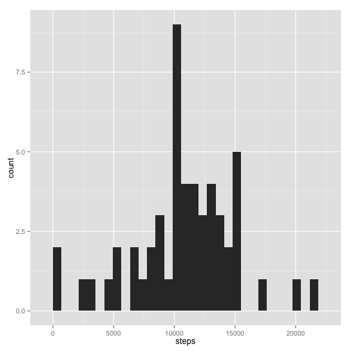
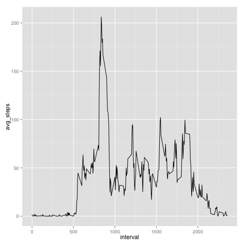
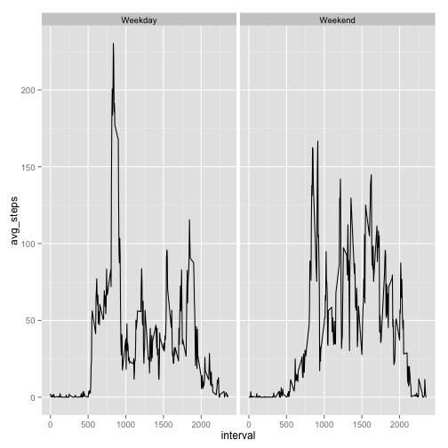

# Reproducible Research: Peer Assessment 1


```r
library(ggplot2)
library(plyr)
```

## Loading and preprocessing the data


```r
unzip('activity.zip')
activities = read.csv('activity.csv')
```

## What is mean total number of steps taken per day?

```r
stepsbyday = ddply(activities,'date',summarise, steps = sum(steps))
qplot(steps,data=stepsbyday)
```

```
## stat_bin: binwidth defaulted to range/30. Use 'binwidth = x' to adjust this.
```

 

```r
steps_mean = mean(stepsbyday$steps,na.rm=T)
steps_median = median(stepsbyday$steps,na.rm=T)
```

The mean of steps by day is 1.0766 &times; 10<sup>4</sup> and the median is 10765  

## What is the average daily activity pattern?


```r
stepsbyinterval = ddply(activities,'interval',summarise, avg_steps = mean(steps,na.rm=T))
ggplot(aes(interval,avg_steps),data=stepsbyinterval)+geom_line()
```

 

```r
maxavgstepsinterval = stepsbyinterval$interval[stepsbyinterval$avg_steps == max(stepsbyinterval$avg_steps)]
```

The interval of time with the most steps average is the  835

## Imputing missing values


```r
nasteps = sum(is.na(activities$steps))
```
The number of of observations with no steps recorded is 2304

The strategy for filling the NA steps values will be to use the average of steps of the interval in wich the NA is found

```r
gh=c()
for (x in activities[is.na(activities$steps),]$interval){
   
  gh=c(gh,stepsbyinterval[stepsbyinterval$interval == x,]$avg_steps)
}

new_activities = activities

new_activities[is.na(new_activities$steps),]$steps <- gh
```

Having done that now lets look at the plot of steps by day


```r
new_stepsbyinterval = ddply(new_activities,'interval',summarise, avg_steps = mean(steps,na.rm=T))
ggplot(aes(interval,avg_steps),data=new_stepsbyinterval)+geom_line()
```

 

The plot seems the same even tought the date have NA filled here the summary of previous and new datasets


```r
summary(activities)
```

```
##      steps               date          interval   
##  Min.   :  0.0   2012-10-01:  288   Min.   :   0  
##  1st Qu.:  0.0   2012-10-02:  288   1st Qu.: 589  
##  Median :  0.0   2012-10-03:  288   Median :1178  
##  Mean   : 37.4   2012-10-04:  288   Mean   :1178  
##  3rd Qu.: 12.0   2012-10-05:  288   3rd Qu.:1766  
##  Max.   :806.0   2012-10-06:  288   Max.   :2355  
##  NA's   :2304    (Other)   :15840
```

```r
summary(new_activities)
```

```
##      steps               date          interval   
##  Min.   :  0.0   2012-10-01:  288   Min.   :   0  
##  1st Qu.:  0.0   2012-10-02:  288   1st Qu.: 589  
##  Median :  0.0   2012-10-03:  288   Median :1178  
##  Mean   : 37.4   2012-10-04:  288   Mean   :1178  
##  3rd Qu.: 27.0   2012-10-05:  288   3rd Qu.:1766  
##  Max.   :806.0   2012-10-06:  288   Max.   :2355  
##                  (Other)   :15840
```


```r
new_stepsbyday = ddply(new_activities,'date',summarise, steps = sum(steps))

new_steps_mean = mean(new_stepsbyday$steps,na.rm=T)
new_steps_median = median(new_stepsbyday$steps,na.rm=T)
```

The mean of steps by day is 1.0766 &times; 10<sup>4</sup> and the median is 1.0766 &times; 10<sup>4</sup> in the new dataset


## Are there differences in activity patterns between weekdays and weekends?
This plot serves as illustration of the differences in patterns from weekdays to weekends


```r
new_activities$day = as.factor(ifelse(weekdays(as.Date(new_activities$date)) %in% c("Saturday","Sunday"), "Weekend", "Weekday")) 

new_stepsbyinterval_withdays = ddply(new_activities,c('interval','day'),summarise, avg_steps = mean(steps,na.rm=T))

ggplot(aes(interval,avg_steps),data=new_stepsbyinterval_withdays)+geom_line()+facet_grid(.~day)
```

 
